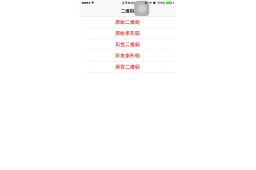

# QRCodeImage

### 原始二维码
通过滤镜CIFilter生成二维码

1. 创建过滤器
2. 给过滤器添加数据
3. 设置滤镜inputMessage数据
4. 输出二维码

<pre>
+ (CIImage *)qrCodeImageWithContent:(NSString *)content{
    CIFilter *qrFilter = [CIFilter filterWithName:@"CIQRCodeGenerator"];
    NSData *contentData = [content dataUsingEncoding:NSUTF8StringEncoding];
    [qrFilter setValue:contentData forKey:@"inputMessage"];
    [qrFilter setValue:@"H" forKey:@"inputCorrectionLevel"];
    CIImage *image = qrFilter.outputImage;
    return image;
}

void ProviderReleaseData (void *info, const void *data, size_t size){
    free((void*)data);
}
</pre>

生成制定大小的二维码

1. 传入原始二维码数据
2. 设置倍数scale
3. 通过bitmapImage放大并保存

<pre>
+ (UIImage *)qrCodeImageWithContent:(NSString *)content codeImageSize:(CGFloat)size{
    CIImage *image = [self qrCodeImageWithContent:content];
    CGRect integralRect = CGRectIntegral(image.extent);
    CGFloat scale = MIN(size/CGRectGetWidth(integralRect), size/CGRectGetHeight(integralRect));  
    size_t width = CGRectGetWidth(integralRect)*scale;
    size_t height = CGRectGetHeight(integralRect)*scale;
    CGColorSpaceRef colorSpaceRef = CGColorSpaceCreateDeviceGray();
    CGContextRef bitmapRef = CGBitmapContextCreate(nil, width, height, 8, 0, colorSpaceRef, (CGBitmapInfo)kCGImageAlphaNone);
    CIContext *context = [CIContext contextWithOptions:nil];
    CGImageRef bitmapImage = [context createCGImage:image fromRect:integralRect];
    CGContextSetInterpolationQuality(bitmapRef, kCGInterpolationNone);
    CGContextScaleCTM(bitmapRef, scale, scale);
    CGContextDrawImage(bitmapRef, integralRect, bitmapImage);
    
    CGImageRef scaledImage = CGBitmapContextCreateImage(bitmapRef);
    CGContextRelease(bitmapRef);
    CGImageRelease(bitmapImage);
    return [UIImage imageWithCGImage:scaledImage];
}
</pre>

### 原始条形码
通过滤镜CIFilter生成二维码

1. 创建过滤器
2. 给过滤器添加数据
3. 设置滤镜inputMessage数据
4. 输出二维码

<pre>
+ (CIImage *)barcodeImageWithContent:(NSString *)content{
    CIFilter *qrFilter = [CIFilter filterWithName:@"CICode128BarcodeGenerator"];
    NSData *contentData = [content dataUsingEncoding:NSUTF8StringEncoding];
    [qrFilter setValue:contentData forKey:@"inputMessage"];
    [qrFilter setValue:@(0.00) forKey:@"inputQuietSpace"];
    CIImage *image = qrFilter.outputImage;
    return image;
}

void ProviderReleaseData (void *info, const void *data, size_t size){
    free((void*)data);
}
</pre>

生成定制大小的条形码

1. 传入原始二维码数据
2. 设置倍数scale
3. 通过bitmapImage放大并保存

<pre>
+ (UIImage *)barcodeImageWithContent:(NSString *)content codeImageSize:(CGSize)size{
    CIImage *image = [self barcodeImageWithContent:content];
    CGRect integralRect = CGRectIntegral(image.extent);
    CGFloat scale = MIN(size.width/CGRectGetWidth(integralRect), size.height/CGRectGetHeight(integralRect));  
    size_t width = CGRectGetWidth(integralRect)*scale;
    size_t height = CGRectGetHeight(integralRect)*scale;
    CGColorSpaceRef colorSpaceRef = CGColorSpaceCreateDeviceGray();
    CGContextRef bitmapRef = CGBitmapContextCreate(nil, width, height, 8, 0, colorSpaceRef, (CGBitmapInfo)kCGImageAlphaNone);
    CIContext *context = [CIContext contextWithOptions:nil];
    CGImageRef bitmapImage = [context createCGImage:image fromRect:integralRect];
    CGContextSetInterpolationQuality(bitmapRef, kCGInterpolationNone);
    CGContextScaleCTM(bitmapRef, scale, scale);
    CGContextDrawImage(bitmapRef, integralRect, bitmapImage);
    
    CGImageRef scaledImage = CGBitmapContextCreateImage(bitmapRef);
    CGContextRelease(bitmapRef);
    CGImageRelease(bitmapImage);
    return [UIImage imageWithCGImage:scaledImage];
}
</pre>

### 彩色二维码

获取原始二维码改变像素点颜色

 1. @param content 二维码数据
 2. @param size 二维码大小
 3. @param red 0 ~ 1.0
 4. @param green 0 ~ 1.0
 5. @param blue 0 ~ 1.0
 
<pre>
+ (UIImage *)qrCodeImageWithContent:(NSString *)content codeImageSize:(CGFloat)size red:(CGFloat)red green:(CGFloat)green blue:(CGFloat)blue{
    UIImage *image = [self qrCodeImageWithContent:content codeImageSize:size];
    int imageWidth = image.size.width;
    int imageHeight = image.size.height;
    size_t bytesPerRow = imageWidth * 4;
    uint32_t *rgbImageBuf = (uint32_t *)malloc(bytesPerRow * imageHeight);
    CGColorSpaceRef colorSpaceRef = CGColorSpaceCreateDeviceRGB();
    CGContextRef context = CGBitmapContextCreate(rgbImageBuf, imageWidth, imageHeight, 8, bytesPerRow, colorSpaceRef, kCGBitmapByteOrder32Little|kCGImageAlphaNoneSkipLast);
    CGContextDrawImage(context, CGRectMake(0, 0, imageWidth, imageHeight), image.CGImage);
    //遍历像素, 改变像素点颜色
    int pixelNum = imageWidth * imageHeight;
    uint32_t *pCurPtr = rgbImageBuf;
    for (int i = 0; i< pixelNum; i++, pCurPtr++) {
        if ((*pCurPtr & 0xFFFFFF00) < 0x99999900) {
            uint8_t* ptr = (uint8_t*)pCurPtr;
            ptr[3] = red*255;
            ptr[2] = green*255;
            ptr[1] = blue*255;
        }else{
            uint8_t* ptr = (uint8_t*)pCurPtr;
            ptr[0] = 0;
        }
    }
    //取出图片
    CGDataProviderRef dataProvider = CGDataProviderCreateWithData(NULL, rgbImageBuf, bytesPerRow * imageHeight, ProviderReleaseData);
    CGImageRef imageRef = CGImageCreate(imageWidth, imageHeight, 8, 32, bytesPerRow, colorSpaceRef,
                                        kCGImageAlphaLast | kCGBitmapByteOrder32Little, dataProvider,
                                        NULL, true, kCGRenderingIntentDefault);
    CGDataProviderRelease(dataProvider);
    UIImage *resultImage = [UIImage imageWithCGImage:imageRef];
    CGImageRelease(imageRef);
    CGContextRelease(context);
    CGColorSpaceRelease(colorSpaceRef);
    
    return resultImage;
}
</pre>

给二维码添加中心logo

<pre>
+ (UIImage *)qrCodeImageWithContent:(NSString *)content
                      codeImageSize:(CGFloat)size
                               logo:(UIImage *)logo
                          logoFrame:(CGRect)logoFrame
                                red:(CGFloat)red
                              green:(CGFloat)green
                               blue:(CGFloat)blue{
    UIImage * image = [self qrCodeImageWithContent:content codeImageSize:size red:red green:green blue:blue];   
    if (logo != nil) {
        UIGraphicsBeginImageContext(image.size);
        [image drawInRect:CGRectMake(0, 0, image.size.width, image.size.height)];
        [logo drawInRect:logoFrame];
        UIImage *resultImage = UIGraphicsGetImageFromCurrentImageContext();
        UIGraphicsEndImageContext();
        return resultImage;
    }else{
        return image;
    }   
}
</pre>

### 彩色条形码

获取原始二维码改变像素点颜色

 1. @param content 二维码数据
 2. @param size 二维码大小
 3. @param red 0 ~ 1.0
 4. @param green 0 ~ 1.0
 5. @param blue 0 ~ 1.0

<pre>
+ (UIImage *)barcodeImageWithContent:(NSString *)content codeImageSize:(CGSize)size red:(CGFloat)red green:(CGFloat)green blue:(CGFloat)blue{
    UIImage *image = [self barcodeImageWithContent:content codeImageSize:size];
    int imageWidth = image.size.width;
    int imageHeight = image.size.height;
    size_t bytesPerRow = imageWidth * 4;
    uint32_t *rgbImageBuf = (uint32_t *)malloc(bytesPerRow * imageHeight);
    CGColorSpaceRef colorSpaceRef = CGColorSpaceCreateDeviceRGB();
    CGContextRef context = CGBitmapContextCreate(rgbImageBuf, imageWidth, imageHeight, 8, bytesPerRow, colorSpaceRef, kCGBitmapByteOrder32Little|kCGImageAlphaNoneSkipLast);
    CGContextDrawImage(context, CGRectMake(0, 0, imageWidth, imageHeight), image.CGImage);
    //遍历像素, 改变像素点颜色
    int pixelNum = imageWidth * imageHeight;
    uint32_t *pCurPtr = rgbImageBuf;
    for (int i = 0; i< pixelNum; i++, pCurPtr++) {
        if ((*pCurPtr & 0xFFFFFF00) < 0x99999900) {
            uint8_t* ptr = (uint8_t*)pCurPtr;
            ptr[3] = red*255;
            ptr[2] = green*255;
            ptr[1] = blue*255;
        }else{
            uint8_t* ptr = (uint8_t*)pCurPtr;
            ptr[0] = 0;
        }
    }
    //取出图片
    CGDataProviderRef dataProvider = CGDataProviderCreateWithData(NULL, rgbImageBuf, bytesPerRow * imageHeight, ProviderReleaseData);
    CGImageRef imageRef = CGImageCreate(imageWidth, imageHeight, 8, 32, bytesPerRow, colorSpaceRef,
                                        kCGImageAlphaLast | kCGBitmapByteOrder32Little, dataProvider,
                                        NULL, true, kCGRenderingIntentDefault);
    CGDataProviderRelease(dataProvider);
    UIImage *resultImage = [UIImage imageWithCGImage:imageRef];
    CGImageRelease(imageRef);
    CGContextRelease(context);
    CGColorSpaceRelease(colorSpaceRef); 
    return resultImage;
}
</pre>

### 渐变二维码

绘制黑白二维码

<pre>
- (UIImage *)genQRCodeImageMask:(UIImage *)image {
    if (image != nil) {
        int bitsPerComponent = 8;
        int bytesPerPixel = 4;
        int width = image.size.width;
        int height = image.size.height;
        unsigned char * imageData = (unsigned char *)malloc(width * height * bytesPerPixel);
        
        // 将原始黑白二维码图片绘制到像素格式为ARGB的图片上，绘制后的像素数据在imageData中。
        CGColorSpaceRef colorSpace = CGColorSpaceCreateDeviceRGB();
        CGContextRef imageContext = CGBitmapContextCreate(imageData, width, height, bitsPerComponent, bytesPerPixel * width, colorSpace, kCGImageAlphaPremultipliedFirst);
        UIGraphicsPushContext(imageContext);
        CGContextTranslateCTM(imageContext, 0, height);
        CGContextScaleCTM(imageContext, 1, -1);
        [image drawInRect:CGRectMake(0, 0, width, height)];
        
        CGColorSpaceRelease(colorSpace);
        
        // 根据每个像素R通道的值修改Alpha通道的值，当Red大于100，则将Alpha置为0，反之置为255
        for (int row = 0; row < height; ++row) {
            for (int col = 0; col < width; ++col) {
                int offset = row * width * bytesPerPixel + col * bytesPerPixel;
                unsigned char r = imageData[offset + 1];
                unsigned char alpha = r > 100 ? 0 : 255;
                imageData[offset] = alpha;
            }
        }
        
        CGImageRef cgMaskImage = CGBitmapContextCreateImage(imageContext);
        UIImage *maskImage = [UIImage imageWithCGImage:cgMaskImage];
        CFRelease(cgMaskImage);
        UIGraphicsPopContext();
        CFRelease(imageContext);
        
        free(imageData);
        return maskImage;
    }
    return nil;
}
</pre>

设置蒙层的颜色

<pre>
- (CAGradientLayer *)gradientLayer {
    if (_gradientLayer == nil) {
        _gradientLayer = [CAGradientLayer new];
        _gradientLayer.colors = @[
                                  (__bridge id)[UIColor colorWithRed: 0x2a / 255.0 green:0x9c / 255.0 blue: 0x1f / 255.0 alpha:1.0].CGColor,
                                  (__bridge id)[UIColor colorWithRed: 0xe6 / 255.0 green:0xcd / 255.0 blue: 0x27 / 255.0 alpha:1.0].CGColor,
                                  (__bridge id)[UIColor colorWithRed: 0xe6 / 255.0 green:0x27 / 255.0 blue: 0x57 / 255.0 alpha:1.0].CGColor
                                  ];
        [self.layer addSublayer: _gradientLayer];
        _gradientLayer.frame = self.bounds;
    }
    return _gradientLayer;
}
</pre>

添加蒙层，设置黑白二维码图片

<pre>- (void)setQRCodeImage:(UIImage *)qrcodeImage {
    UIImage *maskImage = [self genQRCodeImageMask: qrcodeImage];
    self.maskLayer.contents = (__bridge id)maskImage.CGImage;
    self.maskLayer.frame = self.bounds;
    self.gradientLayer.mask = self.maskLayer;
}
</pre>